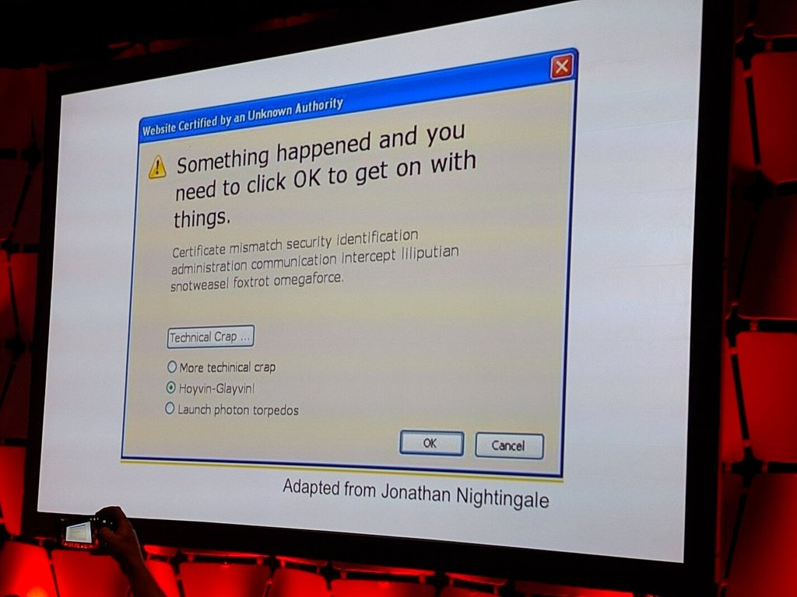

# Setting up Nginx with LetsEncrypt certificates

If you're setting up a web application (or even a testing/staging server for
one), sooner or later you're going to have to bite the bullet and do it
properly. Assuming that you're deploying a non-PHP type application (Ruby,
Node.js, [Smalltalk](http://pharo.org/), Go, and the like), you will need to do
the following:

1. Get yourself a proper SSL certificate (self-generated certs won't cut it).
  (Hopefully I don't need to convince you that you shouldn't be running any
  sort of web app involving users over a plain-text HTTP connection.)
2. Put your app behind a real front end/webserver/proxy, and not just run your
  app as root via `sudo node app.js` on port 80/443 like a hobo. This means:
  [Nginx](http://nginx.org/en/), [Apache](https://httpd.apache.org/), or
  [HAProxy](http://www.haproxy.org/) (or, in some obscure cases, some
  combination of the 3).

Incidentally, you'd be surprised at how hard some developers argue and drag
their feet about that second point. Sure, you can run your app as root on port
443 for a few minutes, just to test everything is working. But don't even think
about leaving it deployed like that, not even on a testing server. No, not even
if the app is trivial and there isn't sensitive data at stake. There is a
reason that front-ending apps with Apache/Nginx/whathaveyou is an industry best
practice.

Also, it's not that difficult to do, so you have no excuse. Let's walk through
the procedure.

See also: https://www.digitalocean.com/community/tutorials/how-to-secure-nginx-with-let-s-encrypt-on-ubuntu-14-04




### Step 0: Pre-Requisites

This post assumes that you've spun up a server and set up its domain name.
Specifically:

* You have a domain name (here, we'll use `example.com`).
* You have access to a server (an inexpensive VPS instance from [Digital
  Ocean](https://www.digitalocean.com/),
  [Scaleway](https://www.scaleway.com/pricing/) or Amazon AWS works great).
  I'll be using Ubuntu here, but the instructions are almost identical for
  CentOS and others.
* You've pointed your domain registrar's DNS records to your VPS host's NS
  servers (so, if you're using DO, your Custom DNS Server entries at the
  registrar will point to `NS1.DIGITALOCEAN.COM`, `NS2. ...` and so on)
* You've set up the proper DNS records (`A` record, and a `CNAME` record for any
  subdomain) on your VPS host's [Networking/DNS
  tab](https://cloud.digitalocean.com/networking#actions-domains). In this
  example, we'll be setting up Nginx to point to `test.example.com`, so we at
  least need a `*` `CNAME` record added to support that subdomain.

### Step 1: Obtain an SSL Certificate with LetsEncrypt

SSL Certificates from recognized Certificate Authorities used to be quite
expensive. For example, that's how Mark Shuttleworth, of Ubuntu/space tourism
fame, partly got his fortune -- by [selling SSL
certificates](https://en.wikipedia.org/wiki/Thawte) back in the day. Over the
years, they have come down in price, but even now, if you want to get a
[Wildcard certificate](https://en.wikipedia.org/wiki/Wildcard_certificate)
(so that it covers arbitrary subdomains), you're looking at anywhere from
[$85](https://www.ssls.com/domain-type/wildcard-ssl-certificates) USD to $500+
per year.

Fortunately, there's also [LetsEncrypt.org](https://letsencrypt.org/).
LetsEncrypt is a remarkable service -- a legit Certificate Authority (CA) that
gives you SSL certificates *for free*, and gives you a command-line client that
lets you do this programmatically.

While LetsEncrypt *doesn't* offer wildcard certs, they do let you include
multiple subdomains in a single certificate, and offer [very reasonable rate
limits](https://community.letsencrypt.org/t/rate-limits-for-lets-encrypt/6769).

See: [LetsEncrypt.org Getting Started Guide](https://letsencrypt.org/getting-started/).

* Install `openssl`

```
./letsencrypt-auto certonly -v --email your@email.com --standalone -d example.com -d test.example.com
```

Generates the certs at `/etc/letsencrypt/live/example.com/`

- Mention renewal

### Step 2: Set up Nginx

`openssl dhparam -out /etc/ssl/certs/dhparam.pem 2048`


```nginx
server {
        root /usr/share/nginx/html;
        index index.html index.htm;

        listen 443 ssl;
        server_name example.com test.example.com;

        ssl_certificate /etc/letsencrypt/live/example.com/fullchain.pem;
        ssl_certificate_key /etc/letsencrypt/live/example.com/privkey.pem;

        ssl_protocols TLSv1 TLSv1.1 TLSv1.2;
        ssl_prefer_server_ciphers on;
        ssl_dhparam /etc/ssl/certs/dhparam.pem;
        ssl_ciphers 'ECDHE-RSA-AES128-GCM-SHA256:ECDHE-ECDSA-AES128-GCM-SHA256:ECDHE-RSA-AES256-GCM-SHA384:ECDHE-ECDSA-AES256-GCM-SHA384:DHE-RSA-AES128-GCM-SHA256\
:DHE-DSS-AES128-GCM-SHA256:kEDH+AESGCM:ECDHE-RSA-AES128-SHA256:ECDHE-ECDSA-AES128-SHA256:ECDHE-RSA-AES128-SHA:ECDHE-ECDSA-AES128-SHA:ECDHE-RSA-AES256-SHA384:ECDHE\
-ECDSA-AES256-SHA384:ECDHE-RSA-AES256-SHA:ECDHE-ECDSA-AES256-SHA:DHE-RSA-AES128-SHA256:DHE-RSA-AES128-SHA:DHE-DSS-AES128-SHA256:DHE-RSA-AES256-SHA256:DHE-DSS-AES2\
56-SHA:DHE-RSA-AES256-SHA:AES128-GCM-SHA256:AES256-GCM-SHA384:AES128-SHA256:AES256-SHA256:AES128-SHA:AES256-SHA:AES:CAMELLIA:DES-CBC3-SHA:!aNULL:!eNULL:!EXPORT:!D\
ES:!RC4:!MD5:!PSK:!aECDH:!EDH-DSS-DES-CBC3-SHA:!EDH-RSA-DES-CBC3-SHA:!KRB5-DES-CBC3-SHA';
        ssl_session_timeout 1d;
        ssl_session_cache shared:SSL:50m;
        ssl_stapling on;
	ssl_stapling_verify on;
        add_header Strict-Transport-Security max-age=15768000;
# ...
}
```

### Extra Credit

* Set up a firewall ([UFW](https://wiki.ubuntu.com/UncomplicatedFirewall) for
  Ubuntu makes for an extremely easy to use firewall package), and close off
  the ports you don't need.
* Make sure your app is running as a service, using either your OS's startup
  daemons (such as [`upstart`](http://upstart.ubuntu.com/) or better yet
  [`supervisord`](http://supervisord.org/) for Ubuntu), or a language-specific
  service runner (such as the excellent [pm2 for
  Node.js](https://www.npmjs.com/package/pm2)).
* Set up logging
* Set up monitoring

--
[Fork this post on GitHub](https://github.com/dmitrizagidulin/computingjoy.com/blob/master/posts-published/2016-05-01-nginx-letsencrypt.md)
